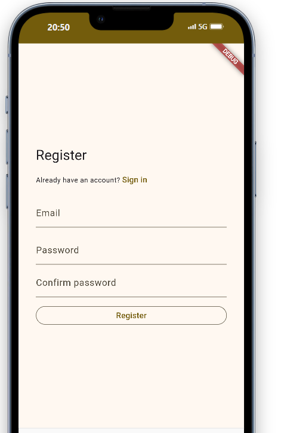
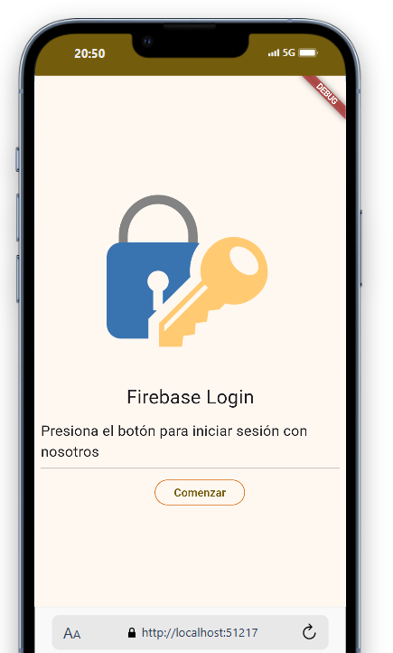
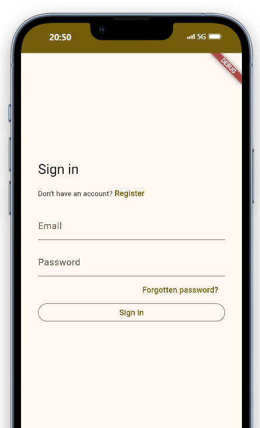
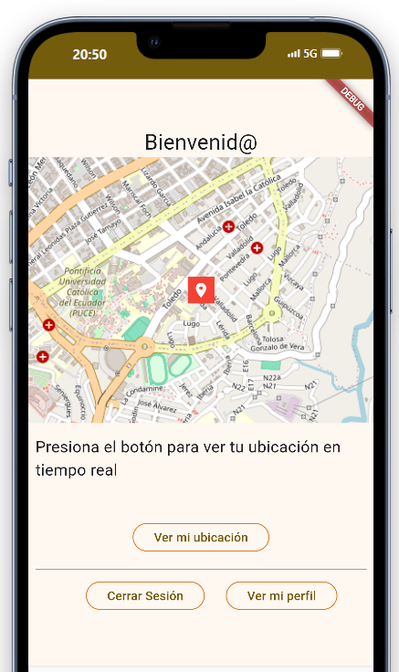

# Mi ubicación

## Descripción 📄

Proyecto en Flutter para mostrar la ubicación en tiempo real.

## Despliegue ⬆️

🌐 **Web**: https://flutter-53e3f.web.app/

📱 **Android**: [APK's](https://github.com/SanguchoMela/login-gps_flutter/releases/tag/v1)

## Funciones 👤

- Registro
- Iniciar y cerrar sesión
- Recuperar Contraseña
- Visualizar ubicación en tiempo real
- Ver perfil

## Herramientas de Desarrollo 🧑‍💻

- Android Studio - Flutter - Firebase - vscode

[](https://skillicons.dev)

## Instalación ⬇️

Clona el proyecto

```bash
  git clone
```

Obtén las dependencias del pubsec.yaml

```bash
  flutter pub get
```

Inicia el servidor

```bash
  flutter run
```

## Funcionamiento 📷

### Registro



### Iniciar y cerrar sesión




### Recuperar Contraseña

### Visualizar ubicación en tiempo real



### Ver perfil


